

<!-- _class: titlepage -->

 Ciclos Econômicos 

 Removendo tendências e isolando ciclos               

 Gabriel Cintra                 

 Florianópolis, Outubro 2023               

 UDESC - ESAG.     

---

# Agenda

      
<!-- _class: cool-list -->

1. _Caracterização de Sistemas_

  

    
        
 

 

           
            
---          
<!-- _class: transition -->  

 Caracterização de Sistemas
    
---
# Sistemas

Um sistema é caracterizado pela relação entre suas entradas e saídas.

 

  

---
# Processos

Sistemas normalmente são compostos por vários processos que interagem entre si.

  

---
# Sistemas Lineares

### Sistemas lineares respeitam o princípio da **superposição**.

Superposição  = Homogeneidade + Aditividade

Dada a função $F$ que representa um sistema linear:

- *Homogeneidade*: 
  $$F(a \cdot x) = a \cdot F(x)$$
- *Aditividade*:
  $$F(x+y) = F(x) + F(y)$$
---

# Sistemas Lineares:

### Em um **Sistema Linear**, a resposta causada por dois ou mais estímulos é a soma das respostas que teriam sido causadas por cada estímulo individualmente.

Se $y_1(t)$ e $y_2(t)$ são soluções do sistema linear, então qualquer combinação linear $A_1 \cdot y_1(t)+A_2 \cdot y_2(t)$ também será uma solução.
 
- *Homogeneidade*: 
  $$F(a \cdot x) = a \cdot F(x)$$
- *Aditividade*:
  $$F(x+y) = F(x) + F(y)$$

---
# Linearidade

**Atenção:**
- Um polinômio é linear se seu grau for menor que 2.
- $a \cdot x + b$ é um polinômio linear.

-  $a \cdot x + b = 0$ é uma equação linear.

- $f(x) = a \cdot x + b$ é uma função linear apenas para $b=0$.

- A derivada é um operador linear.

- A saída de um sistema linear não é necessariamente linear.

- A entrada de um ssitema linear não é necessariamente linear.
---

# Sistemas Estáticos

- *Sistema Estático*: 
  - A saída em qualquer instante depende apenas do valor atual da entrada.
  - Não possui memória ou acúmulo de valores passados; sua resposta é instantânea e direta.
  - É geralmente descrito por uma função algébrica simples, onde a saída é uma função apenas do valor atual da entrada.

   - **Função de Produção:**

$$Y = A \cdot K^\alpha \cdot L^{1-\alpha}$$

- $Y$ é o nível de produção

- $K$ é o capital

- $L$ é o trabalho

- $\alpha$ é a elasticidade do $Y$ em relação a $K$

---
# Sistemas Dinâmicos

- *Sistema Dinâmico*: 
  - A saída depende do tempo e de como o sistema evoluiu ao longo do tempo.
  - Possui memória e um comportamento que se baseia nos valores passados da entrada, o que significa que o estado atual pode influenciar a saída futura.
  - É descrito por equações diferenciais (para sistemas contínuos) ou equações de diferença (para sistemas discretos).

  - **Exemplo**: Acumulação de Capital:

$$\frac{dK(t)}{dt} = sY(t) - \delta K(t)$$

- $K(t)$ é o capital no tempo t

- $Y(t)$ é a produção no tempo t

- $s$ é a taxa de popupança

- $\delta$ é a depreciação

---
# Modelagem

### *Modelo*: representação matemática de um sistema ou processo real.

  

---

# Modelagem

*Importante:* A modelagem é uma ferramenta poderosa para simplificar e entender a realidade, mas apresenta riscos que devem ser considerados:

- **Excesso de Simplificação**: Ignorar detalhes pode comprometer a precisão do modelo.
- **Subsimplificação**: Modelos excessivamente complexos dificultam a análise e a interpretação.
- **Esquecer Abstrações**: É essencial lembrar onde o modelo não se aplica.
- **Confundir Modelo com Realidade**: Um modelo é uma representação, não a realidade.

### Um bom modelo encontra o equilíbrio entre simplicidade e precisão, sendo útil sem perder a realidade de vista.

---

# Exemplo: Sistema dinâmico linear de segunda ordem:

$$
\frac{d^2 y(t)}{dt^2} + \alpha \cdot \frac{d y(t)}{dt} + \beta \cdot y(t) = x(t)
$$

- *Entrada $𝑥(𝑡)$*: O estímulo externo que força o sistema. Essa é a variável que impulsiona ou influencia o comportamento de $𝑦(𝑡)$. Ex: choque econômico.
- *Saída $y(t)$*: A resposta do sistema ao estímulo $x(t)$. É a variável de interesse que queremos entender, prever ou controlar.
- *Parâmetro $\alpha:$* Representa o coeficiente de amortecimento, que define a taxa de dissipação de energia ou a resistência do sistema a mudanças rápidas. Ele controla o comportamento transitório da resposta, como a rapidez e a suavidade com que o sistema responde.
- *Parâmetro $\beta:$* Representa o coeficiente de rigidez ou o termo de restauração, que influencia a tendência do sistema de retornar a um ponto de equilíbrio. Ele define a capacidade de estabilização ou recuperação do sistema após uma perturbação.
---
# Exemplo: Sistema Dinâmico Linear de Segunda Ordem

$$
\frac{d^2 y(t)}{dt^2} + \alpha \cdot \frac{d y(t)}{dt} + \beta \cdot y(t) = x(t)
$$

### Estabilidade: A estabilidade do sistema é determinada pelos coeficientes $\alpha$ e $\beta$:

- **Sistema Estável**: Todas as raízes da equação característica têm **parte real negativa**, o que leva a uma resposta que tende a zero ou se estabiliza com o tempo.
  
- **Sistema Instável**: Se uma ou ambas as raízes da equação característica têm **parte real positiva**. Isso ocorre se $\beta$ for negativo ou for muito pequeno em relação a $\alpha$.

---
# Exemplo: Sistema dinâmico linear de segunda ordem:

$
\frac{d^2 y(t)}{dt^2} + \alpha \cdot \frac{d y(t)}{dt} + \beta \cdot y(t) = x(t)
$

### Como o Sistema Funciona: Sistema estável ($\beta$ positivo e próximo de $\alpha$)

1. **Resposta Inicial (Transiente)**:
   - Quando o sistema recebe um impulso na forma de $x(t)$, ele inicia uma **resposta transitória**, fortemente influenciada por $\alpha$ e $\beta$.
   - O comportamento do sistema neste estágio depende dos valores de $\alpha$ e $\beta$:
     - Se $\alpha$ for grande (alto amortecimento), o sistema rapidamente dissipa a energia e tende a estabilizar sem oscilações.
     - Se $\alpha$ for pequeno, mas $\beta$ for grande, o sistema tende a oscilar ao redor de um valor de equilíbrio antes de se estabilizar.

---

# Exemplo: Sistema dinâmico linear de segunda ordem:

$
\frac{d^2 y(t)}{dt^2} + 0.25 \cdot \frac{d y(t)}{dt} + 1 \cdot y(t) = 10⋅u(t−5)
$

### Como o Sistema Funciona: Sistema estável ($\beta$ positivo e próximo de $\alpha$)
1. **Resposta Inicial (Transiente)**: determinada por $\alpha$ e $\beta$:

  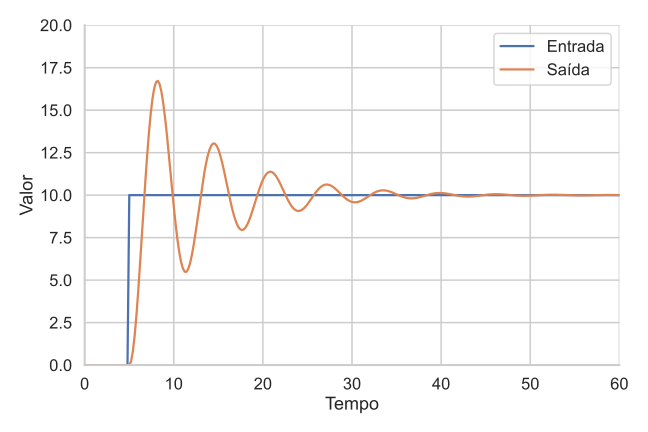

---

# Exemplo: Sistema dinâmico linear de segunda ordem:

$$
\frac{d^2 y(t)}{dt^2} + \alpha \cdot \frac{d y(t)}{dt} + \beta \cdot y(t) = x(t)
$$

### Como o Sistema Funciona: Sistema estável ($\beta$ positivo e próximo de $alpha$)

2. **Comportamento de Longo Prazo (Estacionário)**:
   - Após o período de resposta inicial, o sistema entra em uma fase onde o comportamento é dominado pelo **termo de restauração** $\beta \cdot y(t)$.
   - Dependendo da forma de $x(t)$:
     - Se $x(t)$ for um **impulso** ou um **degrau**, o sistema responderá e depois tenderá a estabilizar-se em um valor de longo prazo.
     - Se $x(t)$ for **periódico** ou **aleatório**, o sistema pode ter uma resposta periódica ou apresentar uma resposta em estado estacionário (comportamento médio constante).

---

# Exemplo: Sistema dinâmico linear de segunda ordem:

$
\frac{d^2 y(t)}{dt^2} + 0.25 \cdot \frac{d y(t)}{dt} + 1 \cdot y(t) = seno(t)
$

### Como o Sistema Funciona: Sistema estável ($\beta$ positivo e próximo de $\alpha$)

2. **Comportamento de Longo Prazo (Estacionário)**: determinado por $\beta$:

  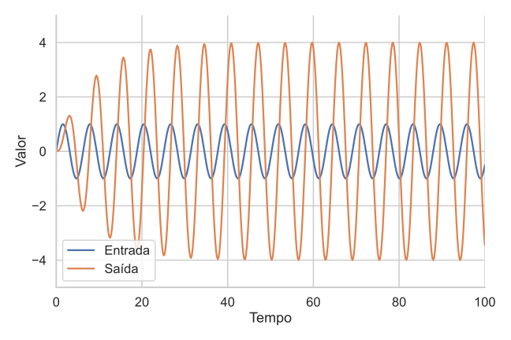

---

# Exemplo: Sistema dinâmico linear de segunda ordem:

$$
\frac{d^2 y(t)}{dt^2} + \alpha \cdot \frac{d y(t)}{dt} + \beta \cdot y(t) = x(t)
$$

### Como o Sistema Funciona: Sistema estável ($\beta$ positivo e próximo de $\alpha$)
3. **Tipos de Resposta Baseados nos Valores de $\alpha$ e $\beta$**:
   - **Subamortecido** ($\alpha^2 < 4\beta$): O sistema oscila antes de estabilizar, com a oscilação sendo amortecida ao longo do tempo. Esse é o caso em que o sistema responde com **oscilações amortecidas**.
   - **Criticamente amortecido** ($\alpha^2 = 4\beta$): O sistema retorna ao equilíbrio o mais rápido possível, sem oscilar. Esse é o comportamento que combina rapidez com estabilidade.
   - **Superamortecido** ($\alpha^2 > 4\beta$): O sistema retorna ao equilíbrio lentamente, sem oscilar. Esse é o caso em que o sistema apresenta uma resposta lenta e gradual.
---

# Exemplo: Sistema dinâmico linear de segunda ordem:

$
\frac{d^2 y(t)}{dt^2} + 0.25 \cdot \frac{d y(t)}{dt} + 1 \cdot y(t) = 10⋅H(t−5)
$

### Como o Sistema Funciona: Sistema estável ($\beta$ positivo e próximo de $\alpha$)
3.1 **Subamortecido** ($\alpha^2 < 4\beta$):
 

  

---

# Exemplo: Sistema dinâmico linear de segunda ordem:

$
\frac{d^2 y(t)}{dt^2} + 2 \cdot \frac{d y(t)}{dt} + 1 \cdot y(t) = 10⋅H(t−5)
$

### Como o Sistema Funciona: Sistema estável ($\beta$ positivo e próximo de $\alpha$)
3.2 **Criticamente amortecido** ($\alpha^2 = 4\beta$):
 

  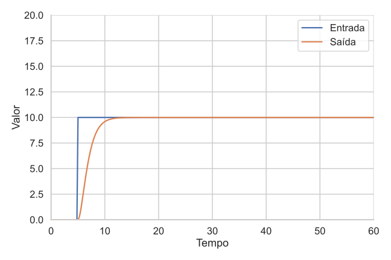

---

# Exemplo: Sistema dinâmico linear de segunda ordem:

$
\frac{d^2 y(t)}{dt^2} + 10 \cdot \frac{d y(t)}{dt} + 1 \cdot y(t) = 10⋅H(t−5)
$

### Como o Sistema Funciona: Sistema estável ($\beta$ positivo e próximo de $\alpha$)
3.3 **Superamortecido** ($\alpha^2 > 4\beta$):
 

  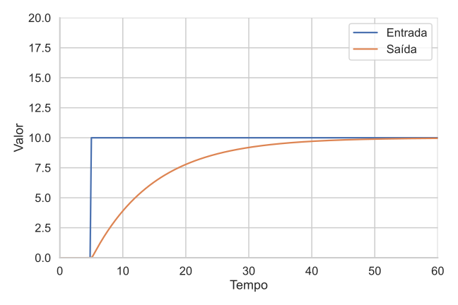

---
# Incerteza
### Sistemas podem ser determinísticos ou estocásticos:

- *Sistema Determinístico*: Sistema fornece a mesma saída para uma dada entrada.
   
- *Sistema Estocástico*: Sistema incorpora aleatoriedade.

---
# Incerteza

### Sistema Estático e Determinístico:

$$y(t) = 2 \cdot t$$

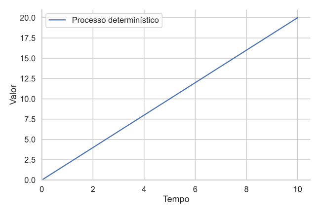

Entrada: $t$ 

Saída: $y(t)$

---
# Incerteza

### Processo Estático e Estocástico:

$$y(t) = 2 \cdot t + u(t)$$

- **$2 \cdot t$**: tendência (parte determinística)
- **$u(t)$**: ruído, choque ou incerteza
  - **$u(t) \sim N(0, 2^2)$**: ruído branco com média zero e variância 4

---

# Incerteza

### Processo Estático e Estocástico:

$$y(t) = 2 \cdot t + u(t)$$

*100 realizações*
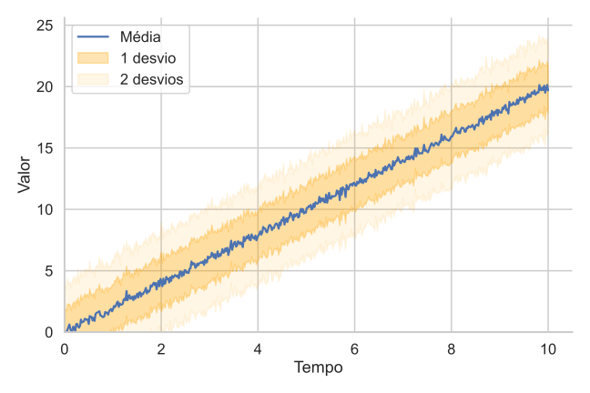

  

$u(t) \sim N(0, 2^2)$

$Var[y(t)] = 2^2$

$E[y(t)] = 2 \cdot t$

---

# Incerteza

### Processo Estático e Estocástico:

$$y(t) = 2 \cdot t + u(t)$$

*100.000 realizações*
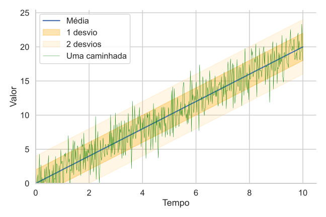

  

$u(t) \sim N(0, 2^2)$

$Var[y(t)] = 2^2$

$E[y(t)] = 2 \cdot t$

---

# Incerteza

### Processo Dinâmico e Estocástico:

$
\frac{d^2 y(t)}{dt^2} + 10 \cdot \frac{d y(t)}{dt} + 1 \cdot y(t) = 10⋅H(t−5) + u(t)
$

*100 realizações*
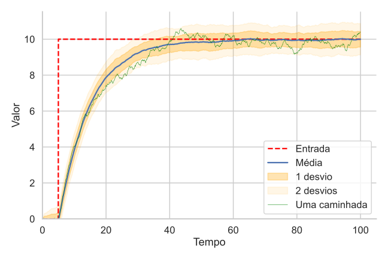

  

$\alpha^2 > 4\beta$ (superamortecido)

$u(t) \sim N(0, 2^2)$

$u(t)$ é inerente ao processo

Entrada $H(t-5)$ é determinística

---
# Processos de Markov

#### É um processo estocástico *sem memória completa*. O estado futuro do processo depende somente do estado atual, independentemente de estados anteriores.

**Exemplo:** Processo de Wiener: processo estocástico contínuo que descreve uma caminhada aleatória ao longo do tempo.

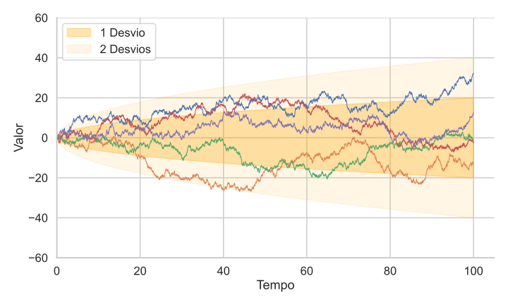

---
# Processo de Wiener

Um processo $W(t)$, onde $t \geq 0$, é um **Processo de Wiener** se satisfaz as seguintes propriedades:

1. **Condição Inicial**: $W(0) = c$, ou seja, o processo tem um valor constante inicial.
   

---
# Processo de Wiener

2. **Incrementos Independentes**: Para $0 \leq s < t$, o incremento $W(t) - W(s)$ é independente dos valores do processo antes de $s$.
   

---
# Processo de Wiener

3. **Incrementos Normais**: Os incrementos $W(t) - W(s)$ são distribuídos normalmente com média zero e variância $t - s$:
    
   $$ W(t) - W(s) \sim N(0, t - s) $$
  
   Isso significa que o valor esperado dos incrementos é zero, e a variância aumenta linearmente com o tempo.

---

# Processo de Wiener

4. **Caminho Contínuo**: O processo $W(t)$ é quase certamente **contínuo** em $t$, mas os caminhos são **não diferenciáveis**.
   - O caminho do processo não apresenta saltos ou descontinuidades bruscas.
  
   - Embora o caminho seja contínuo, ele é extremamente irregular e não possui derivada em quase nenhum ponto. O processo possui **variabilidade infinita em intervalos muito pequenos**.
  
---

# Processo de Wiener

### Representação Diferencial

O processo $W(t)$ pode ser descrito em termos de incrementos infinitesimais:
$$ dW(t) \sim N(0, dt) $$
ou seja, o incremento $dW(t)$ sobre um intervalo infinitesimal $dt$ é normalmente distribuído com média zero e variância $dt$.

---

# Processo de Wiener

### Propriedades Importantes

- **Média**: $E[W(t)] = 0$ 
  O valor esperado do processo é sempre zero, indicando que não há tendência direcional.
- **Variância**: $\text{Var}(W(t)) = t$
  A variância do processo cresce linearmente com o tempo, refletindo que a incerteza aumenta ao longo do tempo.
- **Distribuição de $W(t)$**: Para qualquer $t$, temos $W(t) \sim N(0, t)$ 
  Indicando que o valor do processo em qualquer tempo é normalmente distribuído com média zero e variância $t$.

---

# Processo de Wiener

### Resumo

O **Processo de Wiener** modela o comportamento de um sistema que evolui de maneira puramente aleatória ao longo do tempo, com trajetória contínua e dependente de incrementos estocásticos. Ele é definido pela relação:
$$ W(t) = W(0) + \int_0^t dW(s) $$
onde $dW(s)$ representa incrementos aleatórios normais que definem a evolução do processo.

---

# Processo de Wiener

### Representação para 100 caminhadas:

     

---
<!-- _class: transition3 -->  

 Obrigado!
    
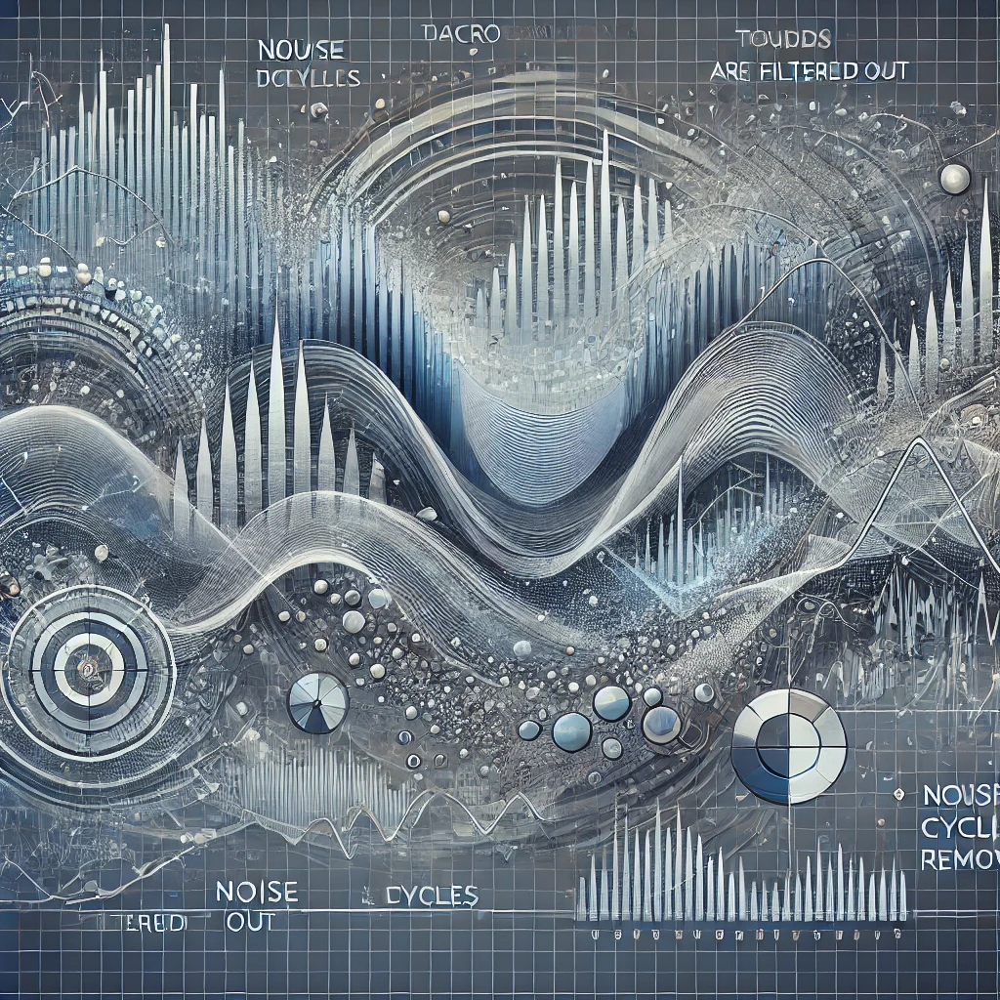