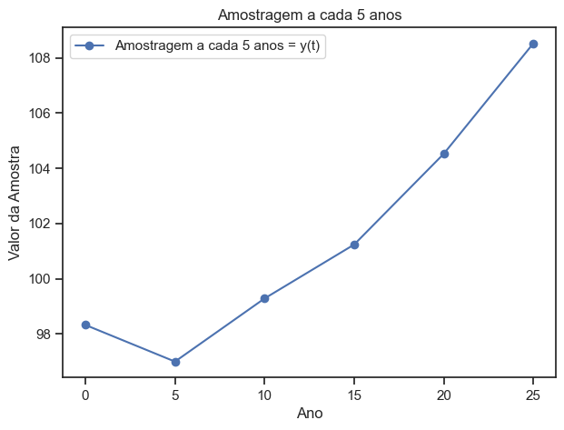
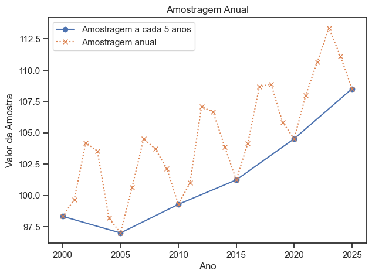
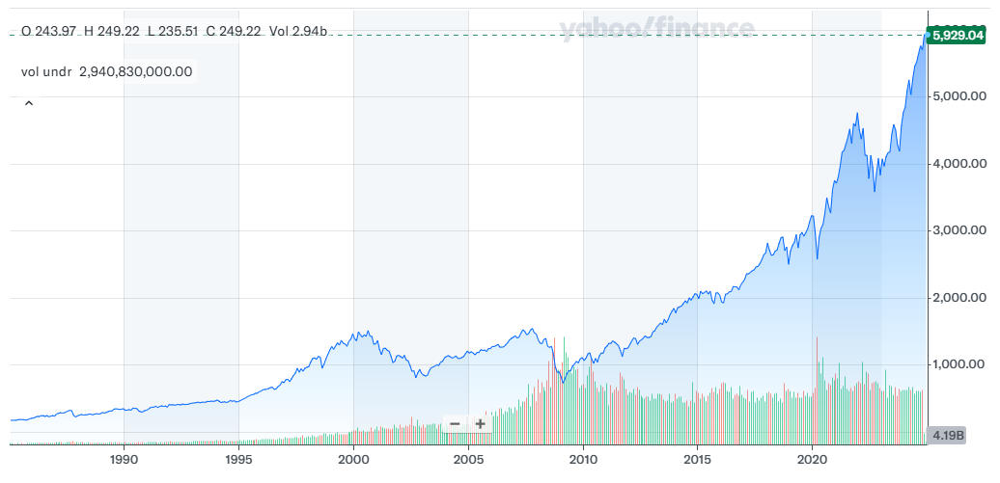
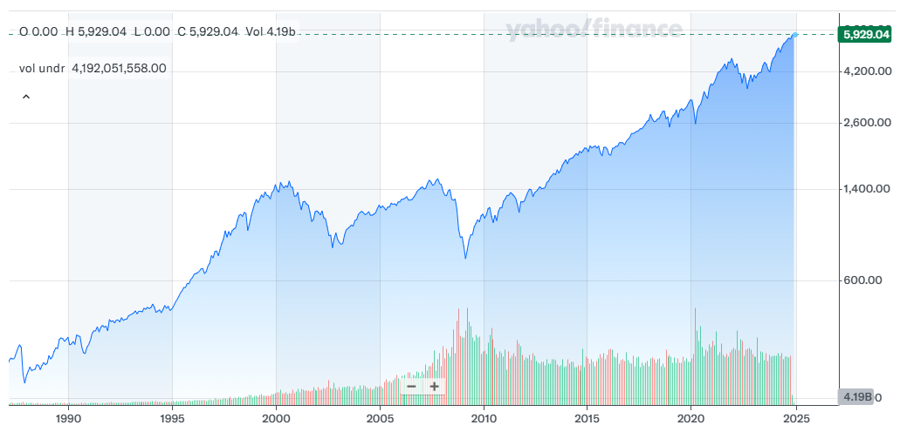
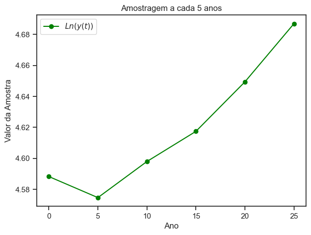
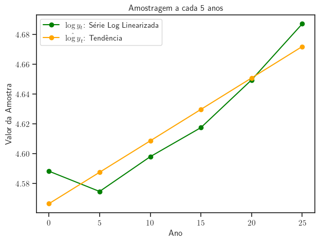
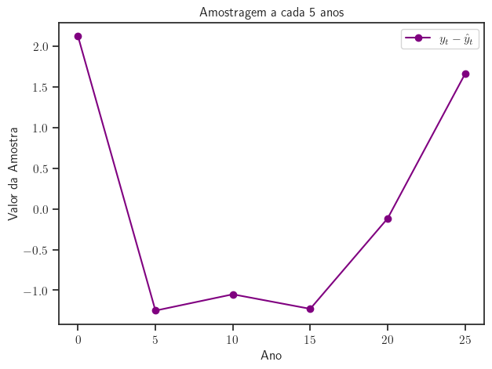

<!-- _class: titlepage -->

 Ciclos Econômicos 

 Removendo tendências e isolando ciclos               

 Gabriel Cintra                 

 Florianópolis, Outubro 2023               

 UDESC - ESAG.     

---

# Agenda

      
<!-- _class: cool-list -->

1. _Caracterização de Sistemas_
2. _Dados Empíricos_
2. _Removendo Tendências - Parte 1_

  

    
        
 

 

           
            
---                   
<!-- _class: transition -->  

Dados Empíricos

---

# Dados empíricos

Dados empíricos são uma **leitura aproximada de uma realidade**.

- Ex: $\triangle$IPCA de outubro $\neq$ $\triangle p$ para encher o tanque do meu carro essa semana.

Dados empíricos possuem:
- metodologia (que traduz sua relação com a realidade)
- precisão
- unidade de medida
- **periodicidade** ou frequência

---
# Dados empíricos

Dados empíricos são **discretos**, ou seja, são **amostragens** de uma realidade contínua.

  

---
# Dados empíricos

Dados empíricos são **discretos**, ou seja, são **amostragens** de uma realidade contínua.

  
  

---
# Dados empíricos

O modelo teórico e os dados empíricos são duas perspectivas de uma realidade.

- Devemos garantir a **correspondência** entre o que é descrito pelo modelo e os dados que são medidos:

  Ex: Não faz sentido usar PIB do IBGE para um modelo de economia fechada.

---
# Preparação dos dados

*Exemplo:* Modelo para analisar ciclos econômicos:

**Ciclos econômicos:** Flutuações recorrentes na atividade econômica, caracterizadas por períodos alternados de expansão e contração da economia.

Os dados empíricos vão conter **tendêcias** e **ciclos**.

A preparação dos dados envolve, portanto, **remover as tendências** antes de **analisar os ciclos**.

---
# Preparação dos dados

**A frequência na qual os dados são coletados determinam em parte seu comportamento cícliclo.**

  
  

---
# Preparação dos dados

Partindo de um modelo que descreve tendências e ciclos, a idéia é:
- *Tratar simetricamente os dados empíricos e teóricos*.

Para:

1. **Remover Tendências**
2. **Isolar Ciclos**

---
# Removendo tendências

*Exemplo:* Modelo para analisar ciclos econômicos:

Modelo é construído para descrever **ciclos e tendências**.

As **tendências** são então removidas em paralelo do modelo e dos dados empíricos.

A solução do modelo fornecerá a variação em relação ao **estado estacionário**.

O **estado estacionário** é interpretado como a posição relativa na curva de tendência.

---
# Isolando ciclos

Ao remover a tendência ficamos apenas com os ciclos.

Ciclos podem ser:
- **Ciclos econômicos**: 6 a 40 trimestres
- **Sazonais**: período < 6 trimestres

A frequência na qual os dados são coletados determinam em parte seu comportamento cícliclo.
- componente sazonal é de pouco interesse
- frequência amostral alta reduz o impacto das componentes cíclicas com período menor

>$Frequência = Período^{-1}$ / Se Período = 3 meses, frequência = 4 ciclos por ano

---          
<!-- _class: transition -->  

Removendo tendências

---
# Removendo tendências

A solução dos modelos costuma ser em termos da versão estacionária das variáveis, onde:
- *o comportamento estocástico das variáveis se dá na forma de variações temporárias a partir do estado estacionário.*
  
- **Variável estacionária**: Componentes cíclicas:
    - Média e variâncias constantes
    - Não apresentam ciclos ou sazonalidade

- **Estado estacionário**:
  - Será a componente de tendência, onde a série possui uma taxa de crescimento constante 
---
# Removendo tendências

Objetivo é transformar a série temporal em um **Processo estocástico estacionário em covariância**, ou *CSSP*, onde a:
- **Média** é constante e igual a zero
- **Variância** é constante e finita
- **Auto-covariância** depende apenas do defasamento
  - Covariância entre dois valores depende apenas da defasagem $k$ entre eles, e não do momento $t$.
  - Covariância é constante para uma dada defasagem $k$.
  $$\gamma(k) = \text{Cov}(X_t, X_{t+k})$$

*A série não apresenta tendência ou sazonalidade e qualquer variação ou "choque" afeta a série temporariamente, mas não de forma permanente.*

---
# Removendo tendências

**Série em nível**: $y_t$ Representam os valores originais das variáveis, como PIB, preços ou produção, em suas unidades originais. Mostram os valores absolutos ao longo do tempo.

**Versões em Log**: $ln(y_t)$
  - Linearização de Crescimento Exponencial
  - Redução de Escala e Variância
  - Diminuição da Heterocedasticidade

*Heterocedasticidade*: a variabilidade da série aumenta conforme os valores absolutos se tornam maiores.

---
# Removendo tendências

**Versões em Log**: $ln(y_t)$

  

    <h4>Série Original</h3>
    
  

  

    <h4>Série Original Log Linearizada</h3>
    
  

---
# Removendo tendências

## Interpretação e Derivação da Taxa de Crescimento

$$
\frac{d}{dt} \ln(y_t)= \frac{\frac{dy(t)}{dt}}{y(t)} \equiv \frac{\dot{y_t}}{y_t} \equiv g_t
$$

$g_t$ representa a **taxa de crescimento percentual instantânea** de $y_t$ e descreve a velocidade com que uma variável está crescendo ou decrescendo em um determinado instante, em termos percentuais.

---

# Removendo tendências:

## Métodos:
1. Detrending
2. Diferenciação
3. Filtro HP
---

# Removendo tendências: Detrending

1. **Modelo Inicial**:
   
   Dada a série $y_t$, assumimos que seus valores obedeçam à seguinte função:
   $$
   y_t = y_0 (1 + g_y)^t e^{u_t}
   $$
   onde:
   - $y_0$ é o nível inicial, 
   - $g_y$ é a taxa de crescimento constante, e 
   - $u_t$ representa um componente CSSP (um choque aleatório)

---
# Removendo tendências: Detrending

2. **Tomando Logaritmos**:
   
   Ao tomar o logaritmo de ambos os lados, o modelo se transforma em uma tendência linear:
   $$
   y_t = y_0 (1 + g_y)^t e^{u_t}
   $$
   $$
   \log y_t = \log y_0 + g_y t + u_t
   $$
   Nesta forma:
   - $\log y_0$ é uma constante,
   - $g_y$ é a taxa de crescimento, também constante, e
   - $u_t$ é o componente estocástico.
> $log(g_y+1)$ aproximado como $g_y$
---
# Removendo tendências: Detrending

3. **Remoção da Tendência**:
   Uma regressão de mínimos quadrados ordinários (MQO) é realizada em $\log y_t$ para estimar a tendência linear: $\hat{\log y}_t = \hat{\alpha}_0 + \hat{\alpha}_1 t$

    Temos que:
     - $y_t = y_0 (1 + g_y)^t e^{u_t}$
     - $\log y_t = \log y_0 + g_y t + u_t$
     - $\log y_t = \hat{\alpha}_0 + \hat{\alpha}_1 t + u_t$
     - $\log y_t = \hat{\log y}_t + u_t$

    Onde:
      - $\hat{\alpha}_0= \log y_0$ ou $y_0 = e^{\hat{\alpha}_0}$
      - $\hat{\alpha}_1= g_y$

---

# Removendo tendências: Detrending

3. **Remoção da Tendência**:

Subtraindo a tendência $\hat{\log y}_t$ de $\log y_t$, obtemos s série sem tendência  $\tilde{y}_t$ (ou $\hat{u}_t$):

$$
\tilde{y}_t = \hat{u}_t = \log y_t - \hat{\alpha}_0 - \hat{\alpha}_1 t
$$

---
# Removendo tendências: Detrending

*Exemplo*: Log linearização e ajuste dos índices temporais:

  

  
  

  

    
  

---
# Removendo tendências: Detrending

*Exemplo*: Mínimos quadrados:

  

Tendência:
- $\hat{\log y}_t = \hat{\alpha}_0 + \hat{\alpha}_1 t$
- $\hat{\alpha}_0= 4.566464273572031$
- $\hat{\alpha}_1= 0.004211711391038625$

  

  

    
  

---
# Removendo tendências: Detrending

*Exemplo*: Removendo a tendência:

  

Tendência:
- $\hat{\log y}_t = \hat{\alpha}_0 + \hat{\alpha}_1 t$
- $\hat{\alpha}_0= 4.566464273572031$
- $\hat{\alpha}_1= 0.004211711391038625$

Série sem tendência:
- $\tilde{y}_t = \hat{u}_t = \log y_t - \hat{\log y}_t$

  

  

    
  

---

# Removendo tendências: Detrending

*Exemplo*: Série não log linearizada:

  

Série Original:
- $y_t = y_0 (1 + g_y)^t e^{u_t}$
- $y_0 = e^{\hat{\alpha}_0} = 96.20335896825594$
- $g_y = \hat{\alpha}_1 = 0.004211711391038625$

Componente de tendência:
- $\hat{y_t} = y_0 (1 + g_y)^t$

  

  
         
  
    

---

# Removendo tendências: Detrending

*Exemplo*: Removendo a tendência

  

Série Original:
- $y_t = y_0 (1 + g_y)^t e^{u_t}$
- $y_0 = e^{\hat{\alpha}_0} = 96.20335896825594$
- $g_y = \hat{\alpha}_1 = 0.004211711391038625$

Componente de tendência:
- $\hat{y_t} = y_0 (1 + g_y)^t$

  

  

    
  

---
<!-- _class: transition3 -->  

 Obrigado!
    
