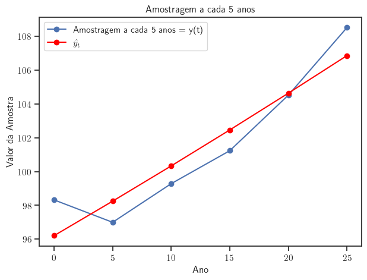
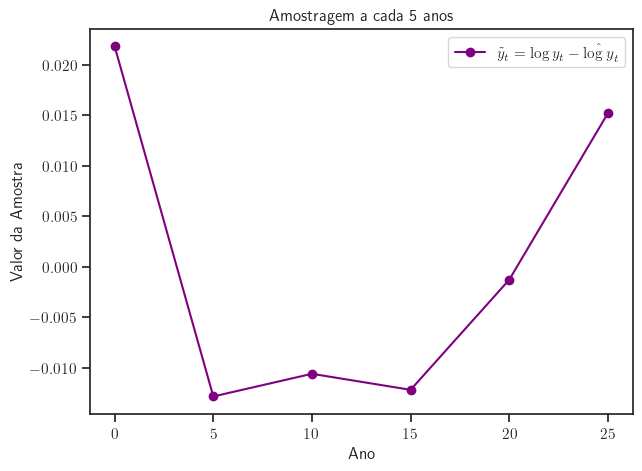
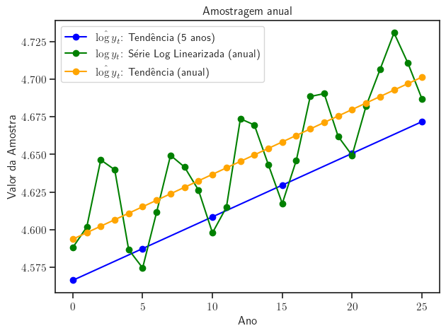
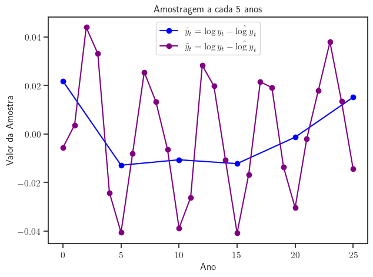
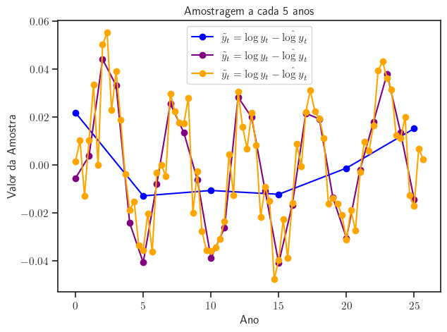
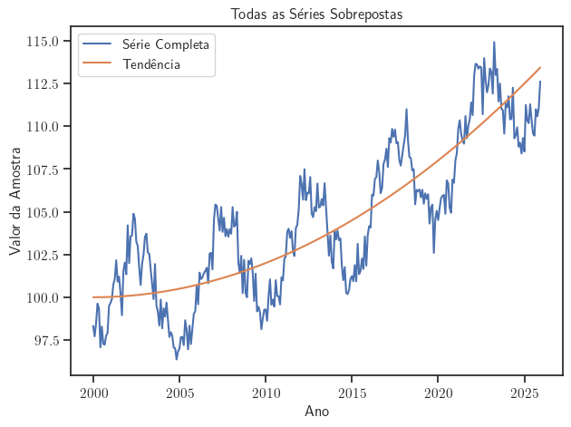
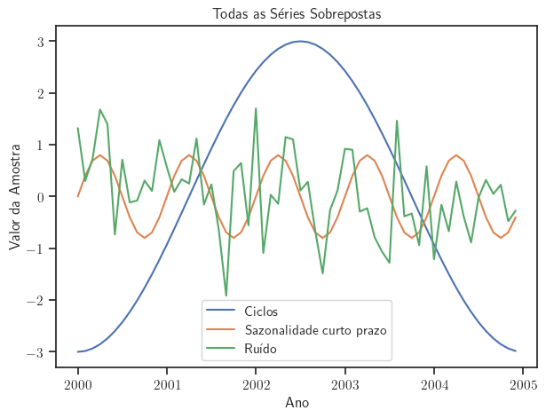

<!-- _class: titlepage -->

 Ciclos Econômicos 

 Removendo tendências e isolando ciclos               

 Gabriel Cintra                 

 Florianópolis, Outubro 2023               

 UDESC - ESAG.     

---

# Agenda

      
<!-- _class: cool-list -->

1. _Caracterização de Sistemas_
2. _Dados Empíricos_
3. _Removendo Tendências - Parte 1_
4. _Removendo Tendências - Parte 2_

  

    
        
 

 

           
            
---                   
<!-- _class: transition -->  

Removendo Tendências - Parte 2

---

# Removendo tendências: Detrending

Detrending linear. Assumimos: $y_t = y_0 (1 + g_y)^t e^{u_t}$

  

Tendência:
- $\hat{\log y}_t = \hat{\alpha}_0 + \hat{\alpha}_1 t$
- $\hat{\alpha}_0= 4.566464273572031$
- $\hat{\alpha}_1= 0.004211711391038625$

Série sem tendência:
- $\tilde{y}_t = \hat{u}_t = \log y_t - \hat{\log y}_t$

  

  

    
  

---

# Removendo tendências: Detrending

Série log linearizada sem tendência: $\tilde{y}_t = \hat{u}_t = \log y_t - \hat{\log y}_t$

  

A série resultante claramente não é  **CSSP**.

O problema está na:
- *Baixa frequência amostral?*
- *Período amostral insuficiente?*
- *Método utilizado?*

  

  

    
  

---

# Removendo tendências: Detrending

Série log linearizada sem tendência: $\tilde{y}_t = \hat{u}_t = \log y_t - \hat{\log y}_t$

  

Detrending amostragem 5 anos:
- $\alpha_0 = 96.2$
- $\alpha_1 = 42.1 \cdot 10^{-4}$

Detrending amostragem anual:
- $\alpha_0 = 98.9$
- $\alpha_1 = 43.0 \cdot 10^{-4}$

  

  

    
  

---

# Removendo tendências: Detrending

Série log linearizada sem tendência: $\tilde{y}_t = \hat{u}_t = \log y_t - \hat{\log y}_t$

  

Detrending amostragem 5 anos:
- $\alpha_0 = 96.2$
- $\alpha_1 = 42.1 \cdot 10^{-4}$

Detrending amostragem anual:
- $\alpha_0 = 98.9$
- $\alpha_1 = 43.0 \cdot 10^{-4}$

  

  

    
  

---
# Removendo tendências: Detrending

Série log linearizada sem tendência: $\tilde{y}_t = \hat{u}_t = \log y_t - \hat{\log y}_t$

  

Detrending amostragem 5 anos:
- $\alpha_0 = 96.2$
- $\alpha_1 = 42.1 \cdot 10^{-4}$
Detrending amostragem anual:
- $\alpha_0 = 98.9$
- $\alpha_1 = 43.0 \cdot 10^{-4}$
Detrending amostragem trimestral:
- $\alpha_0 = 98.1$
- $\alpha_1 = 46.8 \cdot 10^{-4}$

  

  

    
  

---

# Removendo tendências: Detrending

  

  

  

    
  

---

# Removendo tendências: Diferenciação

---
<!-- _class: transition3 -->  

 Obrigado!
    
