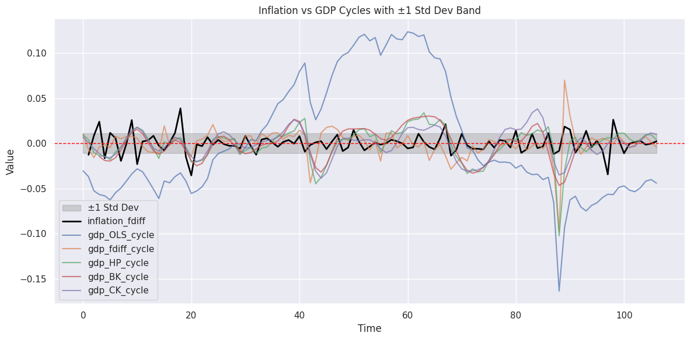
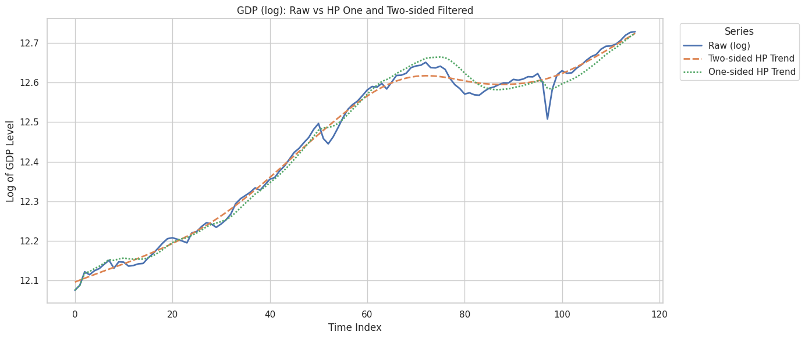
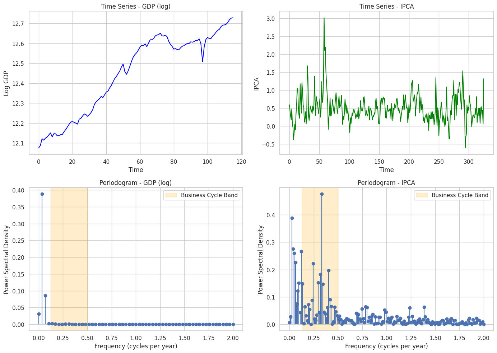
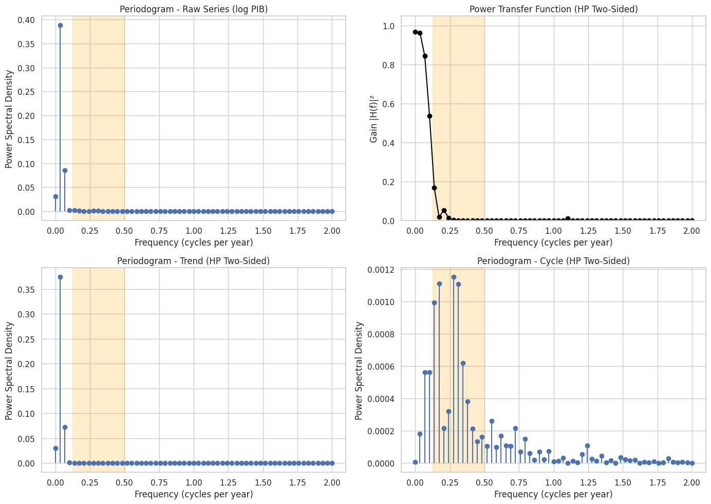
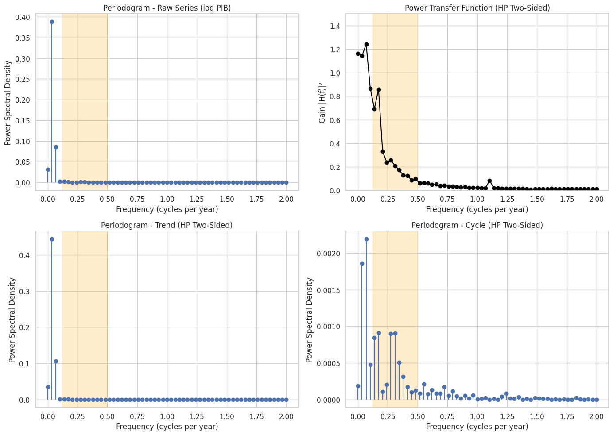
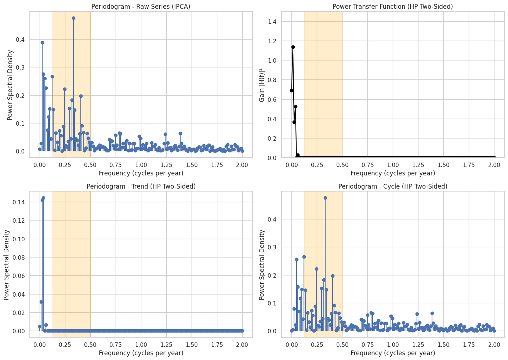

<style>

   .cite-author {     
      text-align        : right; 
   }
   .cite-author:after {
      color             : white;
      font-size         : 125%;
      font-style        : italic;
      font-weight       : bold;
      font-family       : Cambria, Cochin, Georgia, Times, 'Times New Roman', serif; 
      padding-right     : 130px;
   }
   .cite-author[data-text]:after {
      content           : " - "attr(data-text) " - ";      
   }

   .cite-author p {
      padding-bottom : 40px
   }

   .uneven-columns {
      display: grid;
      grid-template-columns: 80% 20%;
      gap: 1em;
   }
</style>

<!-- _class: titlepage -->



<div class="title"         > Filtros HP2 HP1 e BK </div>
<div class="subtitle"      > Implementação e tópicos para discussão                </div>
<div class="author"        > Gabriel Cintra                 </div>
<div class="date"          > Florianópolis, Maio 2025               </div>
<div class="organization"  > UDESC - ESAG.     </div>

---

# Agenda

<div class="columns">
<div>
      
<!-- _class: cool-list -->

1. _Filtro HP One and Two-Sided_
2. _Rudimentos de Análise Espectral_
3. _Filtro BK_

</div>  
<div>    
        
 

</div> 
</div>           
            

---

# Filtro HP2: Hodrick-Prescott Original (Two Sided)

O filtro HP minimiza a seguinte função objetivo:

$$
\min_{\{g_t\}_{t=1}^T} \sum_{t=1}^T (y_t - g_t)^2 + \lambda \sum_{t=2}^{T-1} [(g_{t+1} - g_t) - (g_t - g_{t-1})]^2
$$

Onde:
- $y_t$ é a série observada
- $g_t$ é a tendência
- $\lambda$ é o parâmetro de suavização
- $T$ é o tamanho da amostra

---

# Filtro HP2: Implementação:

### Python:
  
  ```
  cycle, trend = statsmodels.tsa.filters.hp_filter.hpfilter(x, lamb=1600)
  ```

---
# Referências

### Paper Original

[1] Hodrick, Robert J., and Edward C. Prescott. "Postwar U.S. Business Cycles: An Empirical Investigation." Journal of Money, Credit and Banking 29, no. 1 (February 1997): 1–16. https://doi.org/10.2307/2953682.

### Comparação com outros Filtros, propõe a implementação usada no Matlab

[2] Hodrick, Robert J. "An Exploration of Trend-Cycle Decomposition Methodologies in Simulated Data." National Bureau of Economic Research Working Paper No. w26750. Social Science Research Network (February 2020). https://papers.ssrn.com/abstract=3539317.

---

# Problemas do HP2:

## Justificativa teórica paradoxal

O filtro HP só é ótimo estatisticamente se as flutuações cíclicas forem completamente aleatórias. Se esse for de fato o caso, então o “ciclo” que o filtro HP extrai não carrega informações úteis — é puro ruído.

Isso é paradoxal: para que o HP seja estatisticamente ótimo, você precisa acreditar que não existe ciclo verdadeiro, apenas ruído. 

Logo, usar o filtro HP para estudar ciclos só faz sentido se você não acredita que o modelo probabilístico que o justifica seja verdadeiro.

[3] Hamilton, J. D. (2018). Why you should never use the Hodrick-Prescott filter. Review of Economics and Statistics 100

---

# Problemas do HP2:

## Escolha do Fator de Suavização λ

Hodrick e Prescott (1997) definiram $\lambda = 1600$ para dados trimestrais com base em uma suposição subjetiva sobre a relação entre a variância do ciclo e da tendência:

$
\lambda = \frac{\sigma_c^2}{\sigma_v^2} = \left( \frac{5}{\frac{1}{8}} \right)^2 = 1600
$

Ravn e Uhlig (2002) generalizaram essa regra para outras frequências.

Hamilton (2018) argumenta que, se o modelo fosse válido, $\lambda$ poderia ser estimado por máxima verossimilhança, via filtro de Kalman. Na prática, $\sigma_c^2$ não é tão maior que $\sigma_v^2$, o que invalida $\lambda = 1600$ e torna o uso do filtro metodologicamente inconsistente.

---

# Problemas do HP2: [2]

## Dados Espúrios

O filtro HP pode transformar movimentos puramente estocásticos em aparentes ciclos econômicos, levando o pesquisador a interpretar como fenômeno econômico algo que, na prática, é apenas um artefato estatístico do próprio processo de filtragem.

Esse fenômeno é semelhante ao apontado por Nelson e Kang (1981) no contexto do detrending linear, no qual a remoção de uma tendência de séries não estacionárias induz periodicidades falsas, que são função do tamanho da amostra, e não reflexo de qualquer dinâmica econômica real. 

---

# Problemas do HP2: [2]

## Problemas de Borda

Como esse tipo de filtro utiliza informações passadas e futuras para estimar a tendência no ponto presente, as observações próximas ao início e ao fim da amostra recebem pesos diferenciados em relação às observações centrais.

---
# Filtro HP Unilateral: HP1

Não usa dados futuros:

- Usa apenas valores passados de t, através da aplicação recursiva do HP2
- Implica na perda das duas primeiras observações
- Possui resposta em frequência diferente do filtro HP2
- Em resumo, é um outro filtro
  
---
# Filtro HP Unilateral: HP1

Implementação:

### Matlab:
  
  ```
  [trend, cycle] = hpfilter(values, Smoothing=1600, FilterType="one-sided");
  ```
---
# Comparação Visual: HP2 vs HP1

## Variação percentual do IPCA


---
# Comparação Visual: HP2 vs HP1

## PIB real com ajuste sazonal



---
<!-- _class: transition3 -->  

# Rudimentos de análise espectral

---

# Frequência e Período

### Conceitos Fundamentais

- **Frequência (`freq`)**  
  → Número de ciclos por unidade de tempo.  
  → Unidade: **ciclos por ano**

- **Período (`p`)**
  → Tempo que leva para completar um ciclo.
  → Unidade: **anos**  
  → Fórmula: $
p = \frac{1}{freq}
$

---

# Frequência Amostral e Frequência de Nyquist

- **Frequência amostral (`fs`)**  
  → Número de observações por ano.  
  → `fs = 4`: dados trimestrais  
  → `fs = 1`: dados anuais  

- **Frequência de Nyquist (`fn`)**
  → A maior frequência que podemos observar, dada a fs.
  → Fórmula: $
fn = \frac{fs}{2}
$
  → Frequências acima ae fn causam **aliasing** (informação distorcida).  

---

# Exemplo:
- **Unidade da Frequência:** ciclos por **ano**  
- **Frequência amostral fs =** 4 observações por ano (trimestral)  

- **Frequência de Nyquist fn =**  $
\frac{fs}{2} = \frac{4}{2} = 2
$
→ Maior frequência observável: **2 ciclos por ano**  
→ Corresponde a um ciclo com período de **0,5 ano (2 trimestres)**

---

# Faixas de Frequência e Interpretação

| Faixa de Frequência | Período (anos) | Interpretação                                  |
|---------------------|-----------------|-------------------------------------------------|
| **1 – 2**           | 0,5 – 1         | **Ruído e sazonalidade**                       |
| **0,5 – 1**         | 1 – 2           | **Ciclos de curto prazo / sazonalidade estendida** |
| **0,125 – 0,5**     | 2 – 8           | **Ciclos econômicos típicos (business cycles)** |
| **< 0,125**             | ∞               | **Tendência de longo prazo**                   |

---

# O que é um Periodograma?

- O **periodograma** é uma estimativa da **densidade espectral de potência** de uma série temporal discreta.

### Como funciona?

- Decompõe a série em ondas senoidais de diferentes frequências.  
- Avalia a **potência (intensidade)** associada a cada frequência.

### Interpretação

- **Picos no periodograma → Frequências dominantes** na série.  
- Ajuda a identificar:  
  → Tendências  
  → Ciclos (business cycles)  
  → Sazonalidade  
  → Ruído  

---



---

# PTF - Power Transfer Function 

## Função de Transferência de Potência

Representa o ganho de potência do filtro em cada frequência, ou seja, quanto da potência daquela frequência passou pelo filtro para formar a tendência

$
\text{PTF}(f) = \frac{PSD_{trend}(f)}{PSD_{raw}(f)}
$

##  Interpretação:

| PTF valor | Significado                        |
|------------|-------------------------------------|
| **≈ 1**    | Filtro **mantém** essa frequência (presente na tendência) |
| **≈ 0**    | Filtro **remove** essa frequência (fica no ciclo)         |

---


---



---



---


---


---



---
<!-- _class: transition3 -->  

# Filtro BK

---
# BK Filter

### Paper Original

[1] Baxter, Marianne, and Robert G. King. "Measuring Business Cycles: Approximate Band-Pass Filters for Economic Time Series." Review of Economics and Statistics 81, no. 4 (November 1999): 575–93. https://doi.org/10.1162/003465399558454.

---

# Outros

### Frequencia

[8] Granger, Clive W. J. "The Typical Spectral Shape of an Economic Variable." Econometrica 34, no. 1 (January 1966): 150–61. https://doi.org/10.2307/1909859.

### Ciclos Economicos

[3] Burns, Arthur F., and Wesley C. Mitchell. Measuring Business Cycles. Cambridge, MA: National Bureau of Economic Research, 1946.

---

# Findings

Baxter and King (1999) note that this finding of similar cycles from the two methods does not hold true for all series as the HP filter allows more high frequency variation into the cyclical component, and some series, such as inflation, have significant high frequency variation [2]

---

# Estratégia

This section presents a series of tables that examine the mean values of several statistics from 5,000 simula-
tions of six different time series. The statistics are designed to provide information on the performance of
the filtering methodologies of Hodrick and Prescott (1997), Baxter and King (1999), and Hamilton (2018)
in different time series environments. The simulated time series all have 289 observations, the same length
as the GDP data examined above, and they generally have the same sample mean and standard deviation
as the rate of growth of GDP.

---
<!-- _class: transition3 -->  

 Obrigado!
    
